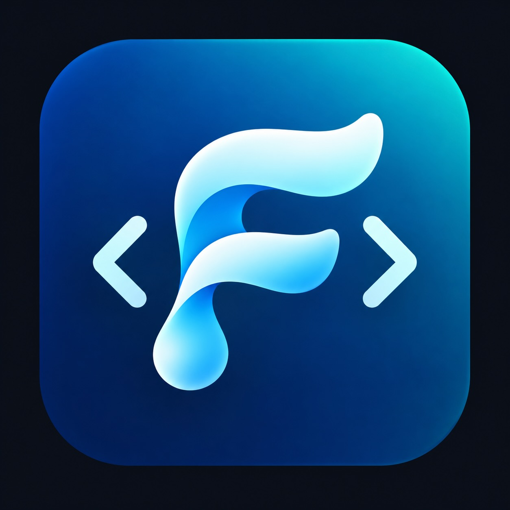

# FluidScript

<p align="center">
  
</p>

**FluidScript** is a small, statically checked scripting language for .NET
applications. It is designed for products that need approachable, user-authored
automation or business rules without granting scripts ambient access to the
file system, network, processes, or arbitrary CLR reflection.

Scripts compile to verified, deterministic P-code and run on a purpose-built
virtual machine. Your application explicitly chooses the functions, data, and
CLR types a script may use.

## Why FluidScript

- **Friendly authoring model** — readable declarations, functions, types,
  arrays, dictionaries, string interpolation, JSON, error handling, and
  familiar `if`, `while`, `for`, and `switch` control flow.
- **Early, useful feedback** — the compiler reports source-mapped diagnostics
  with stable codes before a script runs; runtime faults retain their source
  location and script function context.
- **Capability-based embedding** — the host registers only the operations and
  CLR types it intends to expose. There is no implicit I/O, process, network,
  or reflection capability.
- **Predictable execution** — a verified stack VM with configurable instruction
  limits, a bounded call depth, deterministic P-code serialization, and
  explicit values flowing across the host boundary.
- **Debuggable scripts** — debug P-code preserves source spans. The VM can stop
  on source lines and create a portable, self-contained checkpoint that another
  process can validate and resume.

## A quick taste

```fluid
function greeting(name: string): string
    return "Hello, {name}!"
end

dim names = ["Ada", "Grace", "Lin"]
for index = 0 to 2
    print(greeting(names[index]))
end
```

The standard library is available automatically, including `String`, `RegExp`,
`Number`, and `Math`:

```fluid
dim amount = Number.parseFloat("19.95")
dim tax = Math.round(amount * 0.08 * 100) / 100
print("Total tax: {tax}")
```

## Intended use

FluidScript fits well when an application needs controlled extensibility, for
example:

- configurable business rules, calculations, and validations;
- workflow steps and domain-specific automation;
- user-authored formulas and transformations over application-supplied data;
- scripted behavior in a .NET desktop, service, or web application; and
- an editor/playground experience with compiler diagnostics and source-level
  breakpoints.

It is not a replacement for unrestricted application code. The host owns
security policy, data access, and every external capability exposed to a
script. Give untrusted scripts only narrowly scoped functions and a suitable
instruction budget.

## Get started

FluidScript targets .NET 10. Build and run the test suite from the repository
root:

```sh
dotnet test FluidScript.sln --configuration Release --no-restore
```

To try the included Monaco-based browser playground:

```sh
dotnet run --project fluid-script-monaco/FluidScript.Monaco.csproj
```

Open the local URL printed by ASP.NET Core (normally
`http://localhost:5000` or `https://localhost:5001`). The playground supports
editing, syntax highlighting, diagnostics, execution, breakpoints, detached
debug checkpoints, and JSON-native variable edits. It is a development sample,
not a production-ready multi-user execution service.

## Create a NuGet package

The release helpers increment the patch component in
`fluid-script/FluidScript.csproj`, create a Release package in
`artifacts/nuget/`, and persist the version only after packaging succeeds.

On Windows:

```bat
pack-nuget.bat
```

On macOS or another zsh host:

```sh
./pack-nuget.sh
```

## Documentation

- [User manual](docs/user_manual.md) — learn the language, values, functions,
  flow control, JSON, imports, and the standard libraries.
- [Integration guide](docs/integration.md) — add FluidScript to a .NET project,
  execute and debug scripts, register application libraries/CLR types, persist
  P-code, and provide a module resolver.
- [Language contract](docs/language.md) — the normative language semantics and
  diagnostic behavior.
- [P-code format](docs/pcode.md) — serialization and detached-debugging
  contracts.
- [Monaco sample](fluid-script-monaco/README.md) — details of the browser
  playground and its HTTP protocol.

## Current module scope

`import` is intentionally host-resolved: an application supplies an
`IFluidModuleResolver` that maps a script-visible name to source. Imports
currently validate and compile dependencies, including missing-module and
cycle detection. They do not yet execute modules, export symbols, or create
script namespaces. Use explicit host capabilities for shared behavior until
the staged module-linking features are available.

## Project layout

```text
fluid-script/         Compiler, P-code model, virtual machine, and host API
fluid-script.test/    MSTest coverage for language and runtime behavior
fluid-script-monaco/  ASP.NET Core Monaco playground
docs/                 User, integration, language, P-code, and architecture docs
```
